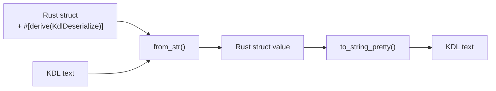

# club-kdl

[](https://crates.io/crates/club-kdl)
[](https://docs.rs/club-kdl)
[](https://github.com/chronista-club/club-kdl/actions/workflows/ci.yml)
[](#license)
[](https://github.com/chronista-club/club-kdl/blob/main/Cargo.toml)
[](https://crates.io/crates/club-kdl)

English | **[日本語](README.md)**

Read and write KDL just by adding a derive macro to your Rust structs.

```toml
[dependencies]
club-kdl = "0.5"
```

## Why club-kdl?

The official Rust implementation of KDL, [`kdl-rs`](https://crates.io/crates/kdl), focuses on **AST-level** manipulation — converting to and from Rust structs is left to you. club-kdl adds an **attribute-based derive layer** on top of kdl-rs, so `#[derive(KdlDeserialize, KdlSerialize)]` is all you need for a full struct ↔ KDL round trip.

| Library | Role | Best for |
|---------|------|----------|
| [`kdl`](https://crates.io/crates/kdl) | KDL parser / AST | Building and editing KDL dynamically / spec-compliant low-level work |
| [`knuffel`](https://crates.io/crates/knuffel) / [`knus`](https://crates.io/crates/knus) | derive-based parser | Spec-compliance focused / parsing-oriented |
| **`club-kdl`** | **derive-based ser/de** | **Bidirectional struct ↔ KDL / automatic parent-child node name resolution / enum data variants** |

club-kdl uses the `kdl` crate (v6) AST internally, so spec compliance is delegated to kdl-rs.

---

## What the derive does



Struct fields are mapped to KDL node structure via `#[kdl(...)]` attributes.

```rust
use club_kdl::{KdlDeserialize, KdlSerialize};

#[derive(Debug, KdlDeserialize, KdlSerialize)]
#[kdl(name = "service")]
struct Service {
    #[kdl(argument)]       // positional argument → "api"
    name: String,

    #[kdl(property)]       // property → image="myapp"
    image: String,

    #[kdl(children)]       // child nodes → resolved via Port::kdl_node_name()
    ports: Vec<Port>,
}

#[derive(Debug, KdlDeserialize, KdlSerialize)]
#[kdl(name = "port")]
struct Port {
    #[kdl(property)]
    host: u16,
    #[kdl(property)]
    container: u16,
}
```

This struct can read and write the following KDL:

```kdl
service "api" image="myapp" {
    port host=8080 container=80
    port host=8443 container=443
}
```

```rust
// Deserialize (KDL → Rust)
let service: Service = club_kdl::from_str(kdl_text).unwrap();

// Serialize (Rust → KDL)
let kdl_text = club_kdl::to_string_pretty(&service).unwrap();
```

---

## Attribute reference

### Container attributes

| Attribute | Description |
|-----------|-------------|
| `#[kdl(name = "...")]` | KDL node name (defaults to the struct name in snake_case) |
| `#[kdl(alias = "...")]` | Alternative node name (multiple allowed; accepted during deserialization) |
| `#[kdl(document)]` | Treat as a whole KDL document (multiple top-level nodes) |

### Field attributes

| Attribute | Description |
|-----------|-------------|
| `#[kdl(argument)]` | Map to a positional argument (auto-indexed) |
| `#[kdl(argument(index = N))]` | Map to the argument at a specific index |
| `#[kdl(arguments)]` | Collect all arguments into a `Vec<T>` |
| `#[kdl(property)]` | Named property (`key=value`) |
| `#[kdl(property(rename = "...")]` | Map to a property with a different name |
| `#[kdl(child)]` | Single child node (resolves the child type's `#[kdl(name)]`) |
| `#[kdl(child(name = "...")]` | Look up a child node by explicit name |
| `#[kdl(child, unwrap_arg)]` | Take the child node's first argument as the value |
| `#[kdl(child, unwrap_args)]` | Take all of the child node's arguments as a `Vec<T>` |
| `#[kdl(children)]` | Collect child nodes into a `Vec<T>` (resolves the child type's `#[kdl(name)]`) |
| `#[kdl(children(name = "...")]` | Filter and collect child nodes by explicit name |
| `#[kdl(child_map)]` | Collect child nodes into a `HashMap<String, String>` |
| `#[kdl(child_map(name = "...")]` | Collect children inside a wrapper node into a HashMap |
| `#[kdl(flatten)]` | Expand a child struct's fields into the parent node |
| `#[kdl(default)]` | Use `Default::default()` when missing |
| `#[kdl(skip)]` | Skip this field during serialization / deserialization |

### Enum attributes

| Attribute | Applies to | Description |
|-----------|------------|-------------|
| `#[kdl(rename = "...")]` | scalar / data | KDL representation of the variant name (defaults to snake_case) |

---

## Enum support

### Scalar enums (used as property / argument values)

An enum where all variants are unit (no data) is mapped to a string in a KDL argument or property.

```rust
#[derive(KdlDeserialize, KdlSerialize)]
enum Direction {
    #[kdl(rename = "client")]
    Client,
    #[kdl(rename = "server")]
    Server,
}

#[derive(KdlDeserialize, KdlSerialize)]
#[kdl(name = "channel")]
struct Channel {
    #[kdl(argument)]
    name: String,
    #[kdl(property)]
    from: Direction,
}
```

```kdl
channel "events" from="server"
```

### Data enums (variant identified by node name)

An enum containing struct / newtype / unit variants identifies the variant by the KDL node name.

```rust
#[derive(KdlDeserialize, KdlSerialize)]
enum Command {
    // struct variant — fields map to argument/property/child
    #[kdl(rename = "move")]
    Move {
        #[kdl(property)]
        x: f64,
        #[kdl(property)]
        y: f64,
    },

    // newtype variant — delegates to the inner type
    #[kdl(rename = "configure")]
    Configure(InnerConfig),

    // unit variant — node name only
    #[kdl(rename = "quit")]
    Quit,
}
```

```kdl
move x=10.0 y=20.0
configure key="debug" value="true"
quit
```

### Collecting child nodes with `Vec<DataEnum>`

Combined with `#[kdl(children)]`, a data enum can collect children with different node names in one go.

```rust
#[derive(KdlDeserialize, KdlSerialize)]
#[kdl(name = "pipeline")]
struct Pipeline {
    #[kdl(argument)]
    name: String,
    #[kdl(children)]
    steps: Vec<Command>,  // collects all of move, configure, quit
}
```

```kdl
pipeline "deploy" {
    move x=1.0 y=2.0
    configure key="env" value="prod"
    quit
}
```

---

## Automatic child node name resolution

`#[kdl(child)]` / `#[kdl(children)]` automatically resolve the child struct's `#[kdl(name = "...")]`. Even when the field name differs from the KDL node name, the mapping is correct without an explicit name.

```rust
#[derive(KdlDeserialize)]
#[kdl(name = "post-setup")]
struct PostSetup {
    #[kdl(argument)]
    command: String,
}

#[derive(KdlDeserialize)]
#[kdl(document)]
struct Config {
    #[kdl(child)]                    // ← PostSetup::kdl_node_name() → "post-setup"
    post_setup: Option<PostSetup>,   //    looked up as "post-setup", not the field name "post_setup"
}
```

```kdl
post-setup "bun install"
```

If the child struct has no `#[kdl(name)]`, it falls back to the field name.

---

## Aliases

Adding `#[kdl(alias = "...")]` to a struct makes deserialization accept the alternative name too.

```rust
#[derive(KdlDeserialize)]
#[kdl(name = "database", alias = "db")]
struct Database {
    #[kdl(argument)]
    url: String,
}
```

Both `database "pg://..."` and `db "pg://..."` deserialize successfully. `kdl_node_name()` always returns the primary name (`"database"`).

---

## Usage examples

### Parsing a whole document

When a KDL file has multiple top-level nodes, use `#[kdl(document)]`:

```rust
#[derive(KdlDeserialize)]
#[kdl(document)]
struct Config {
    #[kdl(children)]    // resolved via Stage::kdl_node_name()
    stages: Vec<Stage>,

    #[kdl(children)]    // resolved via Service::kdl_node_name()
    services: Vec<Service>,
}

let config: Config = club_kdl::from_str(kdl_text).unwrap();
```

### Collecting all arguments

```rust
#[derive(KdlDeserialize, KdlSerialize)]
#[kdl(name = "depends_on")]
struct DependsOn {
    #[kdl(arguments)]
    services: Vec<String>,
}
```

```kdl
depends_on "db" "redis" "cache"
```

### Child node map

```rust
#[derive(KdlDeserialize, KdlSerialize)]
#[kdl(name = "service")]
struct Service {
    #[kdl(argument)]
    name: String,

    #[kdl(child_map, name = "env")]
    environment: HashMap<String, String>,
}
```

```kdl
service "api" {
    env {
        DATABASE_URL "postgres://localhost/db"
        API_KEY "secret"
    }
}
```

### unwrap_arg / unwrap_args

Take only a child node's arguments as the value:

```rust
#[derive(KdlDeserialize, KdlSerialize)]
#[kdl(name = "app")]
struct App {
    #[kdl(child, unwrap_arg)]           // name "my-app" → "my-app"
    name: String,

    #[kdl(child, unwrap_args)]          // tags "web" "api" → vec!["web", "api"]
    tags: Vec<String>,
}
```

```kdl
app {
    name "my-app"
    tags "web" "api"
}
```

### flatten

Expand a child struct's fields into the parent node:

```rust
#[derive(KdlDeserialize, KdlSerialize)]
#[kdl(name = "service")]
struct Service {
    #[kdl(argument)]
    name: String,

    #[kdl(flatten)]
    health: HealthCheck,
}

#[derive(KdlDeserialize, KdlSerialize)]
struct HealthCheck {
    #[kdl(property)]
    interval: u32,
    #[kdl(property)]
    timeout: u32,
}
```

```kdl
service "api" interval=30 timeout=5
```

---

## Supported types

- Integers: `i32`, `i64`, `i128`, `u16`, `u32`, `u64`, `usize`
- Floating point: `f64`
- Boolean: `bool`
- Strings: `String`, `&str` (zero-copy)
- Path: `PathBuf`
- Collections: `Vec<T>`, `HashMap<String, String>`
- Optional: `Option<T>`
- Custom types: implement `FromKdlValue` / `ToKdlValue`

## Guides

For more detailed usage, see [`docs/guide/`](docs/guide/README.en.md):

- [Custom Types Guide](docs/guide/custom-types.en.md) — map your own types (chrono types, newtypes, etc.) to KDL values
- [KDL Design Best Practices](docs/guide/best-practices.en.md) — choosing between argument / property / children, and anti-patterns
- [Troubleshooting](docs/guide/troubleshooting.en.md) — common errors and their fixes

## Benchmarks

`benches/kdl_vs_json.rs` contains a micro-benchmark that reads and writes equivalent docker-compose-like data in both KDL and JSON.

Measured values (Apple Silicon, Rust 1.95, criterion median):

| operation | KDL (club-kdl) | JSON (serde_json) | ratio |
|-----------|----------------|-------------------|-------|
| read  | 486 µs | 4.2 µs | KDL is ~115x slower |
| write |  8.8 µs | 1.7 µs | KDL is ~5x slower |

Run it with:

```sh
cargo bench --bench kdl_vs_json
```

Detailed results are available in the HTML report (`target/criterion/report/index.html`).

**Usage guidance**: KDL is a format optimized for human readability, and reads are clearly heavier than JSON. For frequent re-parsing on a hot path, choose JSON or a binary format (such as rkyv); use club-kdl for **configuration files, declarative schemas, and human-edited DSLs**.

## MSRV (Minimum Supported Rust Version)

The current MSRV is **Rust 1.94**. It is managed via the `rust-version` field in `Cargo.toml` and continuously verified in CI.

MSRV bumps **may happen in a patch release** (following the semver convention).

## Contributing

See [CONTRIBUTING.md](./CONTRIBUTING.md). Please report security issues following the procedure in [SECURITY.md](./SECURITY.md).

## License

This project is licensed under either of the following, at your option:

- Apache License, Version 2.0, ([LICENSE-APACHE](./LICENSE-APACHE) or <https://www.apache.org/licenses/LICENSE-2.0>)
- MIT license ([LICENSE-MIT](./LICENSE-MIT) or <https://opensource.org/licenses/MIT>)

### Contribution

Unless you explicitly state otherwise, any contribution intentionally submitted for inclusion in the work by you, as defined in the Apache-2.0 license, shall be dual licensed as above, without any additional terms or conditions.
