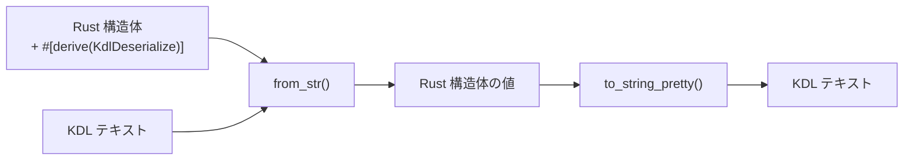

# unison-kdl

[](https://opensource.org/licenses/MIT)
[](https://www.rust-lang.org/)

Rust 構造体に derive マクロを付けるだけで KDL の読み書きができるライブラリ。

```toml
[dependencies]
unison-kdl = { git = "https://github.com/chronista-club/unison-kdl" }
```

---

## derive を付けると何が起こるか



構造体のフィールドと KDL のノード構造が `#[kdl(...)]` 属性で対応付けられる。

```rust
use unison_kdl::{KdlDeserialize, KdlSerialize};

#[derive(Debug, KdlDeserialize, KdlSerialize)]
#[kdl(name = "service")]
struct Service {
    #[kdl(argument)]       // 位置引数 → "api"
    name: String,

    #[kdl(property)]       // プロパティ → image="myapp"
    image: String,

    #[kdl(children, name = "port")]  // 子ノード → port { ... }
    ports: Vec<Port>,
}

#[derive(Debug, KdlDeserialize, KdlSerialize)]
#[kdl(name = "port")]
struct Port {
    #[kdl(property)]
    host: u16,
    #[kdl(property)]
    container: u16,
}
```

この構造体で以下の KDL を読み書きできる:

```kdl
service "api" image="myapp" {
    port host=8080 container=80
    port host=8443 container=443
}
```

```rust
// デシリアライズ（KDL → Rust）
let service: Service = unison_kdl::from_str(kdl_text).unwrap();

// シリアライズ（Rust → KDL）
let kdl_text = unison_kdl::to_string_pretty(&service).unwrap();
```

---

## 属性リファレンス

### 構造体属性

| 属性 | 説明 |
|------|------|
| `#[kdl(name = "...")]` | KDL ノード名（省略時は構造体名の snake_case） |
| `#[kdl(document)]` | KDL ドキュメント全体（複数トップレベルノード）として扱う |

### フィールド属性

| 属性 | 説明 |
|------|------|
| `#[kdl(argument)]` | 位置引数にマッピング（自動インデックス） |
| `#[kdl(argument(index = N))]` | 特定インデックスの引数にマッピング |
| `#[kdl(arguments)]` | 全引数を `Vec<T>` に収集 |
| `#[kdl(property)]` | 名前付きプロパティ（`key=value`） |
| `#[kdl(property(rename = "..."))]` | 別名のプロパティにマッピング |
| `#[kdl(child)]` | 単一の子ノード |
| `#[kdl(children, name = "...")]` | 名前で子ノードを `Vec<T>` に収集 |
| `#[kdl(child_map, name = "...")]` | 子ノードを `HashMap<String, String>` に収集 |
| `#[kdl(flatten)]` | ネストした構造体のフィールドを展開 |
| `#[kdl(default)]` | 欠落時に `Default::default()` を使用 |
| `#[kdl(skip)]` | シリアライズ / デシリアライズをスキップ |

---

## 使い方の例

### ドキュメント全体をパースする

KDL ファイルにトップレベルノードが複数ある場合は `#[kdl(document)]` を使う:

```rust
#[derive(KdlDeserialize)]
#[kdl(document)]
struct Config {
    #[kdl(children, name = "stage")]
    stages: Vec<Stage>,

    #[kdl(children, name = "service")]
    services: Vec<Service>,
}

let config: Config = unison_kdl::from_str(kdl_text).unwrap();
```

### 全引数を収集する

```rust
#[derive(KdlDeserialize, KdlSerialize)]
#[kdl(name = "depends_on")]
struct DependsOn {
    #[kdl(arguments)]
    services: Vec<String>,
}
```

```kdl
depends_on "db" "redis" "cache"
```

### 子ノードマップ

```rust
#[derive(KdlDeserialize, KdlSerialize)]
#[kdl(name = "service")]
struct Service {
    #[kdl(argument)]
    name: String,

    #[kdl(child_map, name = "env")]
    environment: HashMap<String, String>,
}
```

```kdl
service "api" {
    env {
        DATABASE_URL "postgres://localhost/db"
        API_KEY "secret"
    }
}
```

---

## サポートする型

- プリミティブ: `i8`〜`i64`, `u8`〜`u64`, `f32`, `f64`, `bool`
- 文字列: `String`, `&str`（ゼロコピー）
- パス: `PathBuf`
- コレクション: `Vec<T>`, `HashMap<String, String>`
- オプショナル: `Option<T>`
- `FromKdlValue` / `ToKdlValue` を実装したカスタム型

## ライセンス

MIT License - 詳細は [LICENSE](LICENSE) を参照。
