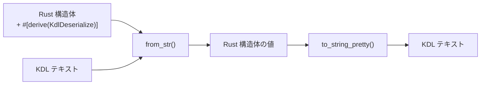

# unison-kdl

[](https://opensource.org/licenses/MIT)
[](https://www.rust-lang.org/)

Rust 構造体に derive マクロを付けるだけで KDL の読み書きができるライブラリ。

```toml
[dependencies]
unison-kdl = { git = "https://github.com/chronista-club/unison-kdl" }
```

---

## derive を付けると何が起こるか



構造体のフィールドと KDL のノード構造が `#[kdl(...)]` 属性で対応付けられる。

```rust
use unison_kdl::{KdlDeserialize, KdlSerialize};

#[derive(Debug, KdlDeserialize, KdlSerialize)]
#[kdl(name = "service")]
struct Service {
    #[kdl(argument)]       // 位置引数 → "api"
    name: String,

    #[kdl(property)]       // プロパティ → image="myapp"
    image: String,

    #[kdl(children)]       // 子ノード → Port::kdl_node_name() で自動解決
    ports: Vec<Port>,
}

#[derive(Debug, KdlDeserialize, KdlSerialize)]
#[kdl(name = "port")]
struct Port {
    #[kdl(property)]
    host: u16,
    #[kdl(property)]
    container: u16,
}
```

この構造体で以下の KDL を読み書きできる:

```kdl
service "api" image="myapp" {
    port host=8080 container=80
    port host=8443 container=443
}
```

```rust
// デシリアライズ（KDL → Rust）
let service: Service = unison_kdl::from_str(kdl_text).unwrap();

// シリアライズ（Rust → KDL）
let kdl_text = unison_kdl::to_string_pretty(&service).unwrap();
```

---

## 属性リファレンス

### 構造体属性

| 属性 | 説明 |
|------|------|
| `#[kdl(name = "...")]` | KDL ノード名（省略時は構造体名の snake_case） |
| `#[kdl(alias = "...")]` | ノード名の別名（複数指定可、デシリアライズ時に受け入れる） |
| `#[kdl(document)]` | KDL ドキュメント全体（複数トップレベルノード）として扱う |

### フィールド属性

| 属性 | 説明 |
|------|------|
| `#[kdl(argument)]` | 位置引数にマッピング（自動インデックス） |
| `#[kdl(argument(index = N))]` | 特定インデックスの引数にマッピング |
| `#[kdl(arguments)]` | 全引数を `Vec<T>` に収集 |
| `#[kdl(property)]` | 名前付きプロパティ（`key=value`） |
| `#[kdl(property(rename = "...")]` | 別名のプロパティにマッピング |
| `#[kdl(child)]` | 単一の子ノード（子型の `#[kdl(name)]` を自動参照） |
| `#[kdl(child(name = "...")]` | 明示名で子ノードを検索 |
| `#[kdl(child, unwrap_arg)]` | 子ノードの第1引数を値として取得 |
| `#[kdl(child, unwrap_args)]` | 子ノードの全引数を `Vec<T>` として取得 |
| `#[kdl(children)]` | 子ノードを `Vec<T>` に収集（子型の `#[kdl(name)]` を自動参照） |
| `#[kdl(children(name = "...")]` | 明示名で子ノードをフィルタして収集 |
| `#[kdl(child_map)]` | 子ノードを `HashMap<String, String>` に収集 |
| `#[kdl(child_map(name = "...")]` | ラッパーノード内の子を HashMap に収集 |
| `#[kdl(default)]` | 欠落時に `Default::default()` を使用 |
| `#[kdl(skip)]` | シリアライズ / デシリアライズをスキップ |

### Enum 属性

| 属性 | 説明 |
|------|------|
| `#[kdl(rename = "...")]` | バリアント名の KDL 文字列（省略時は snake_case） |

---

## 子ノードの名前自動解決

`#[kdl(child)]` / `#[kdl(children)]` は、子構造体の `#[kdl(name = "...")]` を自動参照する。
フィールド名と KDL ノード名が異なる場合でも、明示指定なしで正しくマッピングされる。

```rust
#[derive(KdlDeserialize)]
#[kdl(name = "post-setup")]
struct PostSetup {
    #[kdl(argument)]
    command: String,
}

#[derive(KdlDeserialize)]
#[kdl(document)]
struct Config {
    #[kdl(child)]                    // ← PostSetup::kdl_node_name() → "post-setup"
    post_setup: Option<PostSetup>,   //    フィールド名 "post_setup" ではなく "post-setup" で検索
}
```

```kdl
post-setup "bun install"
```

子構造体に `#[kdl(name)]` がない場合はフィールド名にフォールバックする。

---

## エイリアス

構造体に `#[kdl(alias = "...")]` を付けると、デシリアライズ時に別名も受け入れる。

```rust
#[derive(KdlDeserialize)]
#[kdl(name = "database", alias = "db")]
struct Database {
    #[kdl(argument)]
    url: String,
}
```

`database "pg://..."` でも `db "pg://..."` でもデシリアライズ可能。
`kdl_node_name()` は常に primary name（`"database"`）を返す。

---

## 使い方の例

### ドキュメント全体をパースする

KDL ファイルにトップレベルノードが複数ある場合は `#[kdl(document)]` を使う:

```rust
#[derive(KdlDeserialize)]
#[kdl(document)]
struct Config {
    #[kdl(children)]    // Stage::kdl_node_name() で自動解決
    stages: Vec<Stage>,

    #[kdl(children)]    // Service::kdl_node_name() で自動解決
    services: Vec<Service>,
}

let config: Config = unison_kdl::from_str(kdl_text).unwrap();
```

### 全引数を収集する

```rust
#[derive(KdlDeserialize, KdlSerialize)]
#[kdl(name = "depends_on")]
struct DependsOn {
    #[kdl(arguments)]
    services: Vec<String>,
}
```

```kdl
depends_on "db" "redis" "cache"
```

### 子ノードマップ

```rust
#[derive(KdlDeserialize, KdlSerialize)]
#[kdl(name = "service")]
struct Service {
    #[kdl(argument)]
    name: String,

    #[kdl(child_map, name = "env")]
    environment: HashMap<String, String>,
}
```

```kdl
service "api" {
    env {
        DATABASE_URL "postgres://localhost/db"
        API_KEY "secret"
    }
}
```

### Enum スカラーマッピング

```rust
#[derive(KdlDeserialize, KdlSerialize)]
enum Direction {
    #[kdl(rename = "client")]
    Client,
    #[kdl(rename = "server")]
    Server,
}

#[derive(KdlDeserialize, KdlSerialize)]
#[kdl(name = "channel")]
struct Channel {
    #[kdl(argument)]
    name: String,
    #[kdl(property)]
    from: Direction,
}
```

```kdl
channel "events" from="server"
```

---

## サポートする型

- 整数: `i32`, `i64`, `i128`, `u16`, `u32`, `u64`, `usize`
- 浮動小数点: `f64`
- 真偽値: `bool`
- 文字列: `String`, `&str`（ゼロコピー）
- パス: `PathBuf`
- コレクション: `Vec<T>`, `HashMap<String, String>`
- オプショナル: `Option<T>`
- カスタム型: `FromKdlValue` / `ToKdlValue` を実装

## ライセンス

MIT License - 詳細は [LICENSE](LICENSE) を参照。
