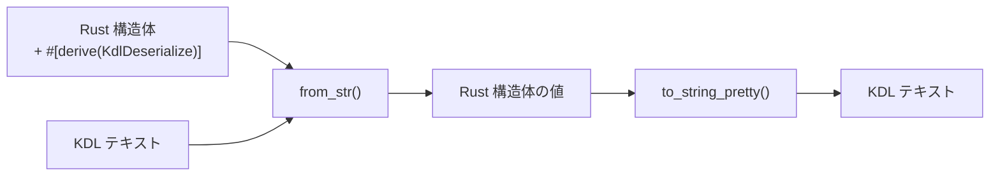

# club-kdl

[](https://crates.io/crates/club-kdl)
[](https://docs.rs/club-kdl)
[](https://github.com/chronista-club/club-kdl/actions/workflows/ci.yml)
[](#license)
[](https://github.com/chronista-club/club-kdl/blob/main/Cargo.toml)
[](https://crates.io/crates/club-kdl)

Rust 構造体に derive マクロを付けるだけで KDL の読み書きができるライブラリ。

```toml
[dependencies]
club-kdl = "0.5"
```

## なぜ club-kdl？

KDL の公式 Rust 実装 [`kdl-rs`](https://crates.io/crates/kdl) は **AST レベル** の操作に集中したライブラリで、 Rust 構造体との往復は手書きが必要。 club-kdl は kdl-rs の上に **属性ベースの derive 層** を載せて、 `#[derive(KdlDeserialize, KdlSerialize)]` だけで struct ↔ KDL の往復を完結させる。

| ライブラリ | 立ち位置 | 適性 |
|-----------|---------|------|
| [`kdl`](https://crates.io/crates/kdl) | KDL parser / AST | 動的に KDL を構築・編集 / spec 準拠の low-level 操作 |
| [`knuffel`](https://crates.io/crates/knuffel) / [`knus`](https://crates.io/crates/knus) | derive ベースの parser | spec 準拠重視 / parse 側に偏る |
| **`club-kdl`** | **derive ベースの ser/de** | **struct ↔ KDL 双方向 / 親子ノード名自動解決 / enum data variants** |

club-kdl は内部で `kdl` crate (v6) の AST を使うので、 spec 準拠は kdl-rs に委譲されている。

---

## derive を付けると何が起こるか



構造体のフィールドと KDL のノード構造が `#[kdl(...)]` 属性で対応付けられる。

```rust
use club_kdl::{KdlDeserialize, KdlSerialize};

#[derive(Debug, KdlDeserialize, KdlSerialize)]
#[kdl(name = "service")]
struct Service {
    #[kdl(argument)]       // 位置引数 → "api"
    name: String,

    #[kdl(property)]       // プロパティ → image="myapp"
    image: String,

    #[kdl(children)]       // 子ノード → Port::kdl_node_name() で自動解決
    ports: Vec<Port>,
}

#[derive(Debug, KdlDeserialize, KdlSerialize)]
#[kdl(name = "port")]
struct Port {
    #[kdl(property)]
    host: u16,
    #[kdl(property)]
    container: u16,
}
```

この構造体で以下の KDL を読み書きできる:

```kdl
service "api" image="myapp" {
    port host=8080 container=80
    port host=8443 container=443
}
```

```rust
// デシリアライズ（KDL → Rust）
let service: Service = club_kdl::from_str(kdl_text).unwrap();

// シリアライズ（Rust → KDL）
let kdl_text = club_kdl::to_string_pretty(&service).unwrap();
```

---

## 属性リファレンス

### 構造体属性

| 属性 | 説明 |
|------|------|
| `#[kdl(name = "...")]` | KDL ノード名（省略時は構造体名の snake_case） |
| `#[kdl(alias = "...")]` | ノード名の別名（複数指定可、デシリアライズ時に受け入れる） |
| `#[kdl(document)]` | KDL ドキュメント全体（複数トップレベルノード）として扱う |

### フィールド属性

| 属性 | 説明 |
|------|------|
| `#[kdl(argument)]` | 位置引数にマッピング（自動インデックス） |
| `#[kdl(argument(index = N))]` | 特定インデックスの引数にマッピング |
| `#[kdl(arguments)]` | 全引数を `Vec<T>` に収集 |
| `#[kdl(property)]` | 名前付きプロパティ（`key=value`） |
| `#[kdl(property(rename = "...")]` | 別名のプロパティにマッピング |
| `#[kdl(child)]` | 単一の子ノード（子型の `#[kdl(name)]` を自動参照） |
| `#[kdl(child(name = "...")]` | 明示名で子ノードを検索 |
| `#[kdl(child, unwrap_arg)]` | 子ノードの第1引数を値として取得 |
| `#[kdl(child, unwrap_args)]` | 子ノードの全引数を `Vec<T>` として取得 |
| `#[kdl(children)]` | 子ノードを `Vec<T>` に収集（子型の `#[kdl(name)]` を自動参照） |
| `#[kdl(children(name = "...")]` | 明示名で子ノードをフィルタして収集 |
| `#[kdl(child_map)]` | 子ノードを `HashMap<String, String>` に収集 |
| `#[kdl(child_map(name = "...")]` | ラッパーノード内の子を HashMap に収集 |
| `#[kdl(flatten)]` | 子構造体のフィールドを親ノードに展開 |
| `#[kdl(default)]` | 欠落時に `Default::default()` を使用 |
| `#[kdl(skip)]` | シリアライズ / デシリアライズをスキップ |

### Enum 属性

| 属性 | 用途 | 説明 |
|------|------|------|
| `#[kdl(rename = "...")]` | スカラー / データ | バリアント名の KDL 表現（省略時は snake_case） |

---

## Enum サポート

### スカラー Enum（プロパティ / 引数の値として使う）

全バリアントが unit（データなし）の enum は、文字列として KDL の引数やプロパティにマッピングされる。

```rust
#[derive(KdlDeserialize, KdlSerialize)]
enum Direction {
    #[kdl(rename = "client")]
    Client,
    #[kdl(rename = "server")]
    Server,
}

#[derive(KdlDeserialize, KdlSerialize)]
#[kdl(name = "channel")]
struct Channel {
    #[kdl(argument)]
    name: String,
    #[kdl(property)]
    from: Direction,
}
```

```kdl
channel "events" from="server"
```

### データ Enum（ノード名でバリアントを判別）

struct / newtype / unit バリアントを含む enum は、KDL ノード名でバリアントを判別する。

```rust
#[derive(KdlDeserialize, KdlSerialize)]
enum Command {
    // struct variant — フィールドはargument/property/childにマッピング
    #[kdl(rename = "move")]
    Move {
        #[kdl(property)]
        x: f64,
        #[kdl(property)]
        y: f64,
    },

    // newtype variant — 内部型にデリゲート
    #[kdl(rename = "configure")]
    Configure(InnerConfig),

    // unit variant — ノード名のみ
    #[kdl(rename = "quit")]
    Quit,
}
```

```kdl
move x=10.0 y=20.0
configure key="debug" value="true"
quit
```

### Vec<DataEnum> で子ノードを収集

データ enum は `#[kdl(children)]` と組み合わせて、異なるノード名の子を一括収集できる。

```rust
#[derive(KdlDeserialize, KdlSerialize)]
#[kdl(name = "pipeline")]
struct Pipeline {
    #[kdl(argument)]
    name: String,
    #[kdl(children)]
    steps: Vec<Command>,  // move, configure, quit を全て収集
}
```

```kdl
pipeline "deploy" {
    move x=1.0 y=2.0
    configure key="env" value="prod"
    quit
}
```

---

## 子ノードの名前自動解決

`#[kdl(child)]` / `#[kdl(children)]` は、子構造体の `#[kdl(name = "...")]` を自動参照する。
フィールド名と KDL ノード名が異なる場合でも、明示指定なしで正しくマッピングされる。

```rust
#[derive(KdlDeserialize)]
#[kdl(name = "post-setup")]
struct PostSetup {
    #[kdl(argument)]
    command: String,
}

#[derive(KdlDeserialize)]
#[kdl(document)]
struct Config {
    #[kdl(child)]                    // ← PostSetup::kdl_node_name() → "post-setup"
    post_setup: Option<PostSetup>,   //    フィールド名 "post_setup" ではなく "post-setup" で検索
}
```

```kdl
post-setup "bun install"
```

子構造体に `#[kdl(name)]` がない場合はフィールド名にフォールバックする。

---

## エイリアス

構造体に `#[kdl(alias = "...")]` を付けると、デシリアライズ時に別名も受け入れる。

```rust
#[derive(KdlDeserialize)]
#[kdl(name = "database", alias = "db")]
struct Database {
    #[kdl(argument)]
    url: String,
}
```

`database "pg://..."` でも `db "pg://..."` でもデシリアライズ可能。
`kdl_node_name()` は常に primary name（`"database"`）を返す。

---

## 使い方の例

### ドキュメント全体をパースする

KDL ファイルにトップレベルノードが複数ある場合は `#[kdl(document)]` を使う:

```rust
#[derive(KdlDeserialize)]
#[kdl(document)]
struct Config {
    #[kdl(children)]    // Stage::kdl_node_name() で自動解決
    stages: Vec<Stage>,

    #[kdl(children)]    // Service::kdl_node_name() で自動解決
    services: Vec<Service>,
}

let config: Config = club_kdl::from_str(kdl_text).unwrap();
```

### 全引数を収集する

```rust
#[derive(KdlDeserialize, KdlSerialize)]
#[kdl(name = "depends_on")]
struct DependsOn {
    #[kdl(arguments)]
    services: Vec<String>,
}
```

```kdl
depends_on "db" "redis" "cache"
```

### 子ノードマップ

```rust
#[derive(KdlDeserialize, KdlSerialize)]
#[kdl(name = "service")]
struct Service {
    #[kdl(argument)]
    name: String,

    #[kdl(child_map, name = "env")]
    environment: HashMap<String, String>,
}
```

```kdl
service "api" {
    env {
        DATABASE_URL "postgres://localhost/db"
        API_KEY "secret"
    }
}
```

### unwrap_arg / unwrap_args

子ノードの引数だけを値として取得する:

```rust
#[derive(KdlDeserialize, KdlSerialize)]
#[kdl(name = "app")]
struct App {
    #[kdl(child, unwrap_arg)]           // name "my-app" → "my-app"
    name: String,

    #[kdl(child, unwrap_args)]          // tags "web" "api" → vec!["web", "api"]
    tags: Vec<String>,
}
```

```kdl
app {
    name "my-app"
    tags "web" "api"
}
```

### flatten

子構造体のフィールドを親ノードに展開する:

```rust
#[derive(KdlDeserialize, KdlSerialize)]
#[kdl(name = "service")]
struct Service {
    #[kdl(argument)]
    name: String,

    #[kdl(flatten)]
    health: HealthCheck,
}

#[derive(KdlDeserialize, KdlSerialize)]
struct HealthCheck {
    #[kdl(property)]
    interval: u32,
    #[kdl(property)]
    timeout: u32,
}
```

```kdl
service "api" interval=30 timeout=5
```

---

## サポートする型

- 整数: `i32`, `i64`, `i128`, `u16`, `u32`, `u64`, `usize`
- 浮動小数点: `f64`
- 真偽値: `bool`
- 文字列: `String`, `&str`（ゼロコピー）
- パス: `PathBuf`
- コレクション: `Vec<T>`, `HashMap<String, String>`
- オプショナル: `Option<T>`
- カスタム型: `FromKdlValue` / `ToKdlValue` を実装

## ベンチマーク

`benches/kdl_vs_json.rs` に同等の docker-compose 風データを KDL と JSON で読み書きするマイクロベンチがあります。

実測値 (Apple Silicon, Rust 1.95, criterion 中央値):

| operation | KDL (club-kdl) | JSON (serde_json) | 倍率 |
|-----------|----------------|-------------------|------|
| read  | 486 µs | 4.2 µs | KDL は ~115x 遅い |
| write |  8.8 µs | 1.7 µs | KDL は ~5x 遅い |

実行:

```sh
cargo bench --bench kdl_vs_json
```

結果は HTML レポート (`target/criterion/report/index.html`) で詳細を確認できます。

**用途のガイド**: KDL は人間可読性に最適化されたフォーマットで、 read は JSON より明確に重いです。 hot-path での頻繁な再パースには JSON / binary フォーマット (rkyv 等) を選び、 **設定ファイル / 宣言的 schema / human-edited DSL** に club-kdl を使ってください。

## MSRV (Minimum Supported Rust Version)

現在の MSRV は **Rust 1.94** です。 `Cargo.toml` の `rust-version` フィールドで管理し、 CI で継続的に検証しています。

MSRV の引き上げは **patch リリースで行うことがあります** (semver の慣習に準拠)。

## Contributing

[CONTRIBUTING.md](./CONTRIBUTING.md) を参照してください。 セキュリティ問題は [SECURITY.md](./SECURITY.md) の手順で報告をお願いします。

## License

このプロジェクトはあなたの選択により以下のいずれかでライセンスされています:

- Apache License, Version 2.0, ([LICENSE-APACHE](./LICENSE-APACHE) or <https://www.apache.org/licenses/LICENSE-2.0>)
- MIT license ([LICENSE-MIT](./LICENSE-MIT) or <https://opensource.org/licenses/MIT>)

### Contribution

特に明示的に別段の定めがない限り、 あなたが意図的に提出した、 Apache-2.0 ライセンスで定義されている、本作品に含めるためのコントリビューションは、 追加の条項なしに上記のようにデュアルライセンスされるものとします。
