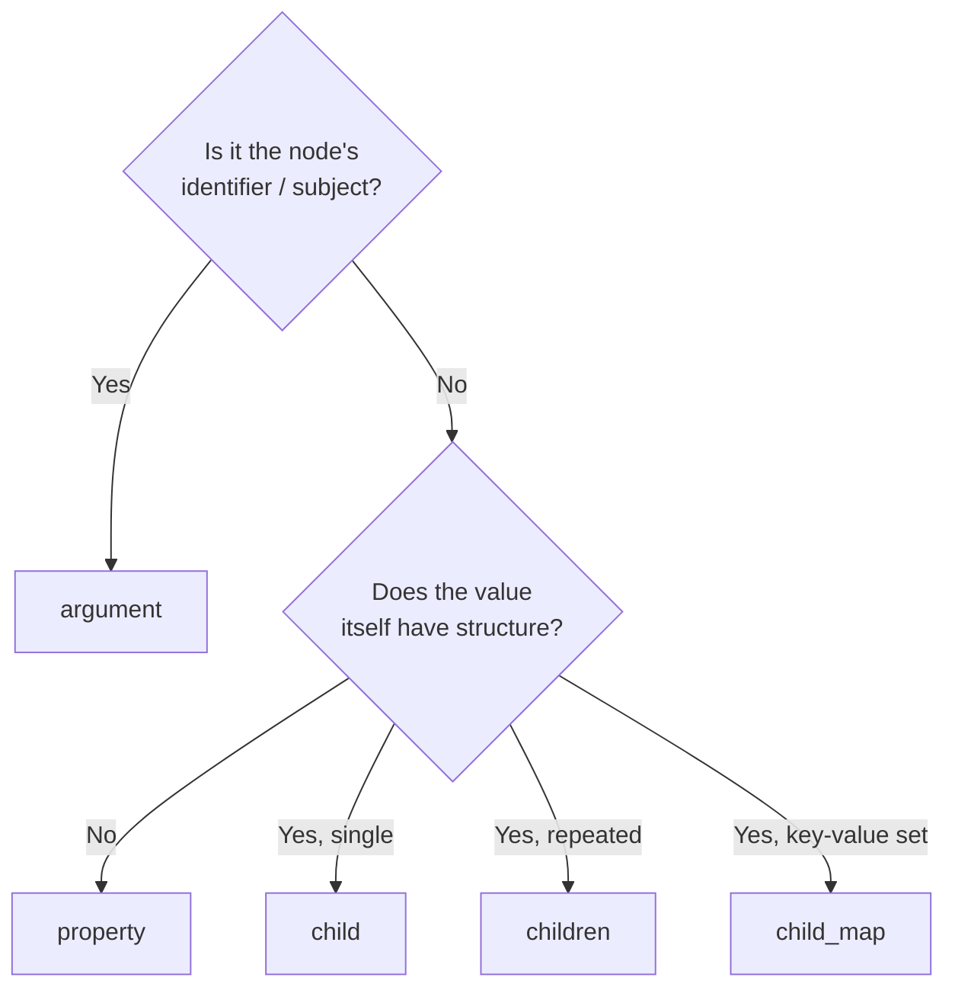

# KDL Design Best Practices

English | **[日本語](./best-practices.md)**

Guidelines and anti-patterns for designing idiomatic KDL schemas.

## Overview

A KDL node has three elements: **arguments** (positional), **properties** (`key=value`),
and **children** (child nodes). Because the same data can be expressed in multiple
forms, a consistent set of criteria determines how readable and maintainable your
schema is.

## Argument or property?

| Element | Nature | Suited for |
|---------|--------|------------|
| argument | Identified by position; order is meaningful | The node's "subject" / identifier. Up to 1-2 |
| property | Identified by name; order-independent | Attributes. Optional ones, or when there are many |

**Guideline**: "What is this node about" = argument; "what are its attributes" = property.

```kdl
// Good: the name (subject) is an argument, attributes are properties
service "api" image="myapp" replicas=3
```

```kdl
// Anti-pattern: everything as arguments ―― you can't tell which position is what
service "api" "myapp" 3
```

When you reach 3 or more arguments, that is usually a sign most of them should be properties.

## Choosing between child / children / child_map

| Attribute | Multiplicity | Rust type |
|-----------|--------------|-----------|
| `#[kdl(child)]` | a single child, 0..1 | `T` / `Option<T>` |
| `#[kdl(children)]` | repeated children of the same kind | `Vec<T>` |
| `#[kdl(child_map)]` | a set of key-value pairs | `HashMap<String, String>` |

## Avoid wrapper nodes

```kdl
// Anti-pattern: the `ports` wrapper is redundant in KDL terms
service "api" {
    ports {
        port host=8080
        port host=8443
    }
}
```

```kdl
// Good: place child nodes directly
service "api" {
    port host=8080
    port host=8443
}
```

club-kdl's `#[kdl(children)]` collects automatically via the child type's
`#[kdl(name)]`, so a grouping wrapper node is unnecessary.

## Simple values as properties, structured values as children

```kdl
// Good: scalar values as properties
service "api" image="myapp"
```

```kdl
// Redundant: a scalar value needlessly made a child node
service "api" {
    image "myapp"
}
```

Make something a child node only when "the value itself has structure" (the child
has arguments / properties / children of its own).

## Use flatten to collapse unnecessary nesting

When you want to expand an auxiliary struct into the parent node rather than
splitting it into a separate node, use `#[kdl(flatten)]`:

```rust
#[derive(KdlDeserialize, KdlSerialize)]
#[kdl(name = "service")]
struct Service {
    #[kdl(argument)]
    name: String,
    #[kdl(flatten)]
    health: HealthCheck,   // interval / timeout sit directly on service
}
```

```kdl
service "api" interval=30 timeout=5
```

You get both Rust-side type separation (separation of concerns) and KDL-side flatness.

## Use scalar enums for states and kinds

Finite choices like "kind", "direction", or "mode" should be scalar enums rather
than `String`:

```rust
#[derive(KdlDeserialize, KdlSerialize)]
enum Protocol {
    #[kdl(rename = "tcp")]
    Tcp,
    #[kdl(rename = "udp")]
    Udp,
}
```

Typos and undefined values become deserialization errors, and the KDL side becomes
self-describing.

## Summary ―― decision flowchart



## See also

- The "Attribute reference" section of the README for each attribute's syntax
- [Custom Types Guide](./custom-types.en.md) ―― extending the value types of property/argument
