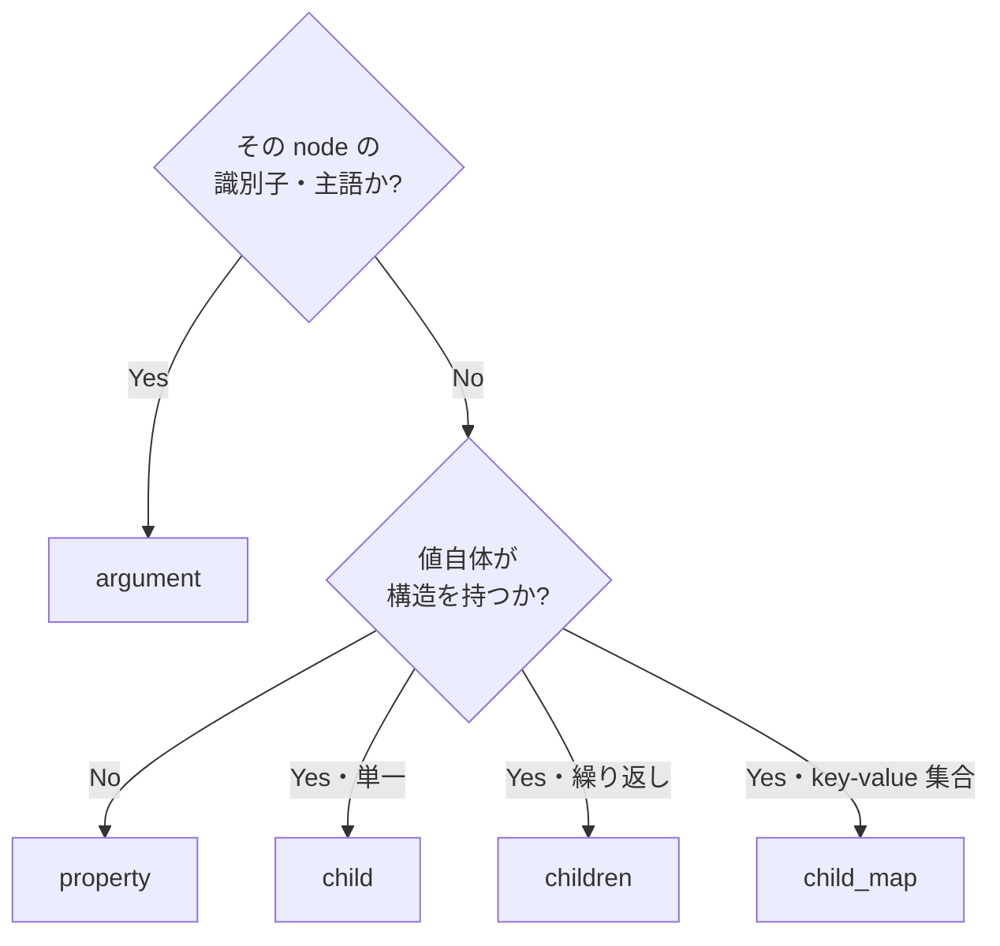

# KDL 設計ベストプラクティス

KDL スキーマを idiomatic に設計するための指針とアンチパターン。

## Overview

KDL ノードは **argument** (位置引数)・**property** (`key=value`)・**children** (子ノード) の
3 要素を持ちます。 同じデータを複数の形で表現できてしまうため、 一貫した判断基準が
スキーマの読みやすさ・保守性を左右します。

## argument か property か

| 要素 | 性質 | 向くもの |
|------|------|---------|
| argument | 位置で識別・順序が意味を持つ | その node の「主語」「識別子」。 1〜2 個まで |
| property | 名前で識別・順序非依存 | 属性。 省略可能なもの・数が多いもの |

**指針**: 「この node は何についてか」 = argument、 「その属性は何か」 = property。

```kdl
// 良い: 名前 (主語) は argument、 属性は property
service "api" image="myapp" replicas=3
```

```kdl
// アンチパターン: 全部 argument ―― 何番目が何か読み取れない
service "api" "myapp" 3
```

argument が 3 個以上になったら、 多くは property にすべきサインです。

## child / children / child_map の使い分け

| 属性 | 多重度 | Rust 型 |
|------|--------|---------|
| `#[kdl(child)]` | 0..1 の単一の子 | `T` / `Option<T>` |
| `#[kdl(children)]` | 同種の子の繰り返し | `Vec<T>` |
| `#[kdl(child_map)]` | key-value の集合 | `HashMap<String, String>` |

## ラッパーノードを避ける

```kdl
// アンチパターン: `ports` ラッパーは KDL 的に冗長
service "api" {
    ports {
        port host=8080
        port host=8443
    }
}
```

```kdl
// 良い: 子ノードを直接並べる
service "api" {
    port host=8080
    port host=8443
}
```

club-kdl の `#[kdl(children)]` は子型の `#[kdl(name)]` で自動収集するため、
グルーピング用のラッパーノードは不要です。

## 単純値は property、 構造値は child

```kdl
// 良い: スカラー値は property に
service "api" image="myapp"
```

```kdl
// 冗長: スカラー値をわざわざ子ノードにしている
service "api" {
    image "myapp"
}
```

子ノードにするのは「その値自体が構造を持つ」 とき (子に argument/property/children がある)
に限ります。

## flatten で不要な階層を畳む

補助的な struct を別ノードに切り出さず、 親ノードに展開したいときは `#[kdl(flatten)]`:

```rust
#[derive(KdlDeserialize, KdlSerialize)]
#[kdl(name = "service")]
struct Service {
    #[kdl(argument)]
    name: String,
    #[kdl(flatten)]
    health: HealthCheck,   // interval / timeout が service に直接乗る
}
```

```kdl
service "api" interval=30 timeout=5
```

Rust の型分割 (関心の分離) と KDL の平坦さを両立できます。

## スカラー enum で状態・種別を型安全に

「種別」 「方向」 「モード」 のような有限の選択肢は `String` ではなく scalar enum に:

```rust
#[derive(KdlDeserialize, KdlSerialize)]
enum Protocol {
    #[kdl(rename = "tcp")]
    Tcp,
    #[kdl(rename = "udp")]
    Udp,
}
```

タイプミスや未定義値がデシリアライズ時のエラーになり、 KDL 側も自己記述的になります。

## まとめ ―― 判断フローチャート



## 関連

- README の「属性リファレンス」 で各属性の構文を確認
- [カスタム型ガイド](./custom-types.md) ―― property/argument の値型を拡張する
